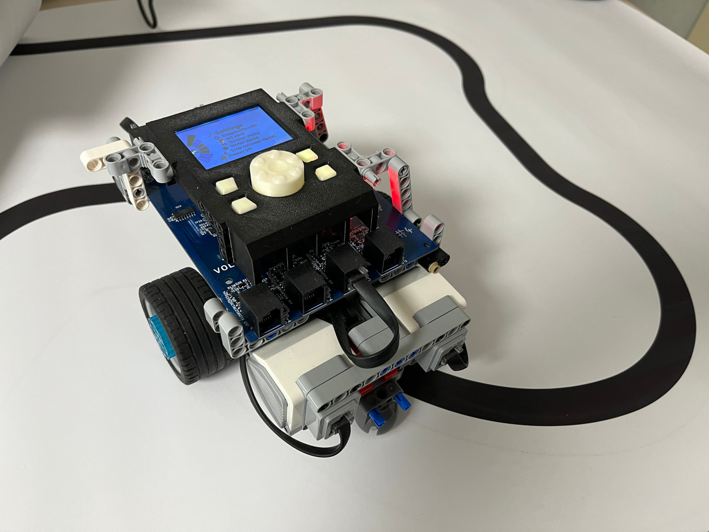

# Brian - modern lego computer
Discussion, feedback and forum for users of Brian

Brian is a drop in replacement lego computer for older EV3 and NXT bricks. It is a project developed by [Voltavian](https://voltavian.com) and funded by Czech Technical University, for the need of [robosoutěž](https://robosoutez.fel.cvut.cz/) - a lego robo race.

## This repository

Use this repository [(issues page)](https://github.com/Voltavian/brian-forum/issues) as a forum, place for feedback or bug report tool. You can write in English or Czech.
Thank you for all your support and cooperation.

## Useful resources

* Online documentation: https://staging.voltavian.com/docs/brian/
* Firmware source code repository: https://github.com/Voltavian/brian-firmware
* Schematic of the hardware: https://github.com/Voltavian/brian-firmware/blob/stable/Reference/schematic.LATEST.pdf
* Voltavian: https://voltavian.com
* Robosoutěž - CTU FEE lego robo race: https://robosoutez.fel.cvut.cz/
